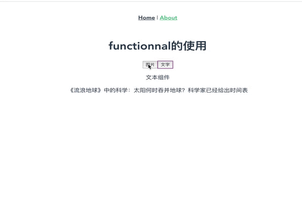

 vue的functionnal使用 

<!--more-->
 Vue.js 组件提供了一个 functional 开关，设置为 true 后，就可以让组件变为无状态、无实例的函数化组件。因为只是函数，所以渲染的开销相对来说，较小。

函数化的组件中的 Render 函数，提供了第二个参数 context 作为上下文，data、props、slots、children 以及 parent 都可以通过 context 来访问。

1.新建一个functionnal.js（名字随意，只要是js文件）文件
  ```javascript
    //图片组件设置
      // eslint-disable-next-line no-unused-vars
      var imgOptions = {
      props: ["data"],
      render: function(createElement) {
        return createElement("div", [
          createElement("p", "图片组件"),
          createElement("img", {
            attrs: {
              src: this.data.url,
              height: 300,
              weight: 400
            }
          })
        ]);
      }
    };
    //文字组件设置
    // eslint-disable-next-line no-unused-vars
    var textOptions = {
      props: ["data"],
      render: function(createElement) {
        return createElement("div", [
          createElement("p", "文本组件"),
          createElement("span", {
            attrs: {
              height: 300,
              weight: 400
            }
          }),
          this.data.content
        ]);
      }
    };

    // eslint-disable-next-line no-unused-vars
    var renderData = {};

    export default {
      functional: true,
      render(createElement, { data }) {
        console.log(data);
        if (data.attrs.data.type === "text") {
          renderData = textOptions;
        } else if (data.attrs.data.type === "img") {
          renderData = imgOptions;
        }
        return createElement(renderData, data);
      }
    };
```
2.例如在About.vue文件中使用
  ```javascript
    <template>
      <div class="about">
        <h1>functionnal的使用</h1>
        <button @click="log('img')">图片</button>
        <button @click="log('text')">文字</button>
        <functionalVue :data="data"></functionalVue>
      </div>
    </template>

    <script>
    import functionalVue from "./functionnal";
    export default {
      data() {
        return {
          data: {}
        };
      },
      components: {
        functionalVue
      },
      methods: {
        log(type) {
          if (type === "img") {
            this.data = {
              type: type,
              url:
                "http://pic-bucket.ws.126.net/photo/0001/2019-02-07/E7D8PON900AO0001NOS.jpg"
            };
          } else {
            this.data = {
              type: type,
              content:
                "《流浪地球》中的科学：太阳何时吞并地球？科学家已经给出时间表"
            };
          }
        }
      },
      created() {
        this.data = {
          type: "text",
          content: "《流浪地球》中的科学：太阳何时吞并地球？科学家已经给出时间表"
        };
      }
    };
    </script>

  ```
